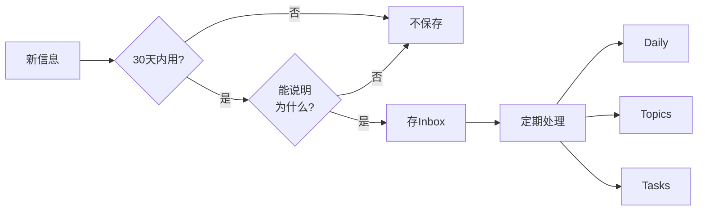

# 个人信息系统 - 快速参考手册 (Cheat Sheet)

一页纸快速查阅，打印贴在电脑旁。

---

## 🚀 核心原则 (3秒记住)

```
┌─────────────────────────────────────────┐
│  统一入口 → 80/20法则 → 行动导向         │
│  所有信息先进Inbox，只保留20%精华       │
└─────────────────────────────────────────┘
```

---

## ⚡ 每日工作流 (20分钟)

### 🌅 早晨 (5分钟)
```
1. 打开Notion Daily
2. 查看今日Tasks
3. 挑选3个最重要的
```

### 🌙 晚上 (15分钟)
```
1. 清理浏览器标签页 (5min)
   → 有用的存Inbox，其余关闭
2. 处理Inbox (5min)
   → 分流到Daily/Topics/Tasks
3. 填写Daily Page (3min)
   → 输入/输出/想法/复盘
4. 设置明日待办 (2min)
```

---

## 📅 每周工作流 (30分钟)

### 周日晚上
```
1. 回顾本周 (10min)
   → 浏览每天的Daily
   → 提取3件重要的事

2. 清空Inbox (15min)
   → 资源 → Topics
   → 想法 → Daily
   → 待办 → Tasks
   → 垃圾 → 删除

3. 整理Tasks (5min)
   → 删除僵尸任务
   → 更新过期任务

4. 规划下周 (5min)
   → 创建下周关键任务
```

---

## 🔄 信息流转速查



**口诀**: 30天+一句话

---

## 🏷️ Notion 4大模块

```
📥 INBOX     → 统一入口（所有碎片先进这里）
📅 DAILY     → 日常记录（每天输入/输出/想法）
🏷️ TOPICS    → 知识库（6个主题：学业/职业/技术/生活/兴趣/资源）
🎯 LIFE HUB  → 执行中心（Tasks/Goals/Projects/Habits/Finance）
```

---

## 🌳 浏览器标签页决策树

```
看标签页 → 记得是什么？
  └─ 不记得 → ❌ 关
  └─ 记得 → 是垃圾？
      └─ 是 → ❌ 关
      └─ 否 → 看过了？
          └─ 看过且吸收 → ❌ 关
          └─ 看过未吸收 → 💾 存Inbox → 关
          └─ 未看 → 学习资料？
              └─ 是 → 💾 存Topics → 关
              └─ 否 → 需行动？
                  └─ 是 → 📝 创建Task → 关
                  └─ 否 → ❌ 关
```

**规则**: 能删就删，先存后关

---

## 📁 文件命名规则

```
格式: [年份]-[来源]-[类型]-[主题]-[编号]

示例:
  2025-手机-照片-风景-001.jpg
  2025-截图-图片-工作-003.png
  2024-B站-视频-教程-Python-001.mp4
```

**占位符**:
- `{year}` - 年份
- `{month}` - 月份
- `{day}` - 日期
- `{counter}` - 序号
- `{source}` - 来源

---

## 🔍 收藏筛选3问

```
1. 如果明天消失，我会找回它吗？
2. 过去30天看过吗？
3. 它改变了我的生活吗？

都是"否" → 删除
```

---

## ⚠️ 系统健康指标

| 指标 | 🟢 健康 | 🟡 预警 | 🔴 危险 |
|------|---------|---------|---------|
| Inbox | <30 | 30-100 | >100 |
| 标签页 | <20 | 20-50 | >50 |
| Daily连续 | 每天 | 3天断 | 7天断 |
| Review | 每周做 | 1周未做 | 2周未做 |

**红色警报行动**:
- Inbox>100 → 立即花1小时清空
- 标签页>50 → 全部关闭或存储
- 7天未填Daily → 重启系统

---

## 🛠️ 工具速查

### Windows快捷键
```
Ctrl+Shift+A     - Edge打开所有标签页管理
Ctrl+W           - 关闭当前标签页
Ctrl+Shift+T     - 恢复刚关闭的标签页
Win+V            - 剪贴板历史
Win+D            - 显示桌面
```

### Notion快捷键
```
Ctrl+N           - 新建页面
Ctrl+E           - 打开搜索
/page            - 创建子页面
/database        - 创建数据库
/todo            - 创建待办
[[               - 链接到其他页面
@               - 提及人员/页面
```

### Python脚本
```bash
# 书签分析
python bookmark_analyzer.py bookmarks.html --csv output.csv

# 批量重命名
python file_renamer.py /path/to/photos --execute

# 文件去重
python duplicate_finder.py /path/to/folder --delete
```

---

## 📋 检查清单模板

### 每日检查清单
```
☐ 早：查看今日Tasks (5min)
☐ 晚：清理标签页 (5min)
☐ 晚：处理Inbox (5min)
☐ 晚：填写Daily (5min)
☐ Inbox保持<30条
☐ 标签页保持<20个
```

### 每周检查清单
```
☐ 回顾本周Daily Pages
☐ 清空Inbox (归零)
☐ 整理Tasks (删除僵尸任务)
☐ 规划下周关键任务
☐ 清理外部平台 (B站/知乎收藏)
```

### 每月检查清单
```
☐ 浏览本月所有Daily
☐ 检查Goals进度
☐ 清理Topics (删除过时内容)
☐ 清理文件系统 (下载/桌面)
☐ 运行去重工具
☐ 备份重要文件
```

---

## 🚨 常见问题快速解决

| 问题 | 原因 | 解决方案 |
|------|------|----------|
| Inbox堆积 | 只存不清 | 设定每天晚上15分钟清理 |
| 标签页爆炸 | 随时打开不关 | 睡前清理，早上从0开始 |
| Daily断链 | 忘记填写 | 手机设置晚上10点提醒 |
| 系统太复杂 | 想要完美 | 删除不用的模块，只保留4个核心页面 |
| 无法坚持 | 目标太高 | 降低标准：每天只需10分钟 |

---

## 💡 金句提醒

```
┌────────────────────────────────────────────┐
│ "收藏 ≠ 学习"                               │
│ "完美的记忆是诅咒，遗忘是大脑的智慧"        │
│ "停止囤积，开始消费"                        │
│ "20%的精华 > 100%的完整"                   │
│ "系统的价值 = 初始搭建 × 持续维护"          │
└────────────────────────────────────────────┘
```

---

## 📊 30天进度追踪卡

```
第1周: 基础搭建 + 习惯养成
  ☐ Day 1: Notion + 清理标签页
  ☐ Day 2-7: 每日例行流程
  ☐ 目标: 连续7天填Daily

第2周: 平台迁移
  ☐ OneNote → Notion
  ☐ 书签 → Notion
  ☐ B站/知乎收藏清理
  ☐ 目标: 外部平台清理50%

第3周: 文件整理
  ☐ 照片去重+重命名
  ☐ 视频筛选
  ☐ 文档整理
  ☐ 目标: 文件系统建立

第4周: 稳定运行
  ☐ 每日维护成为习惯
  ☐ 系统优化
  ☐ 目标: 自然运行不需思考

进度: ☐☐☐☐☐☐☐☐☐☐ 0%
```

---

## 🎯 第1天行动清单 (今天就做！)

```
☐ 1. 创建Notion账号并登录 (5min)

☐ 2. 创建4个顶级页面 (20min)
    ☐ 📥 INBOX
    ☐ 📅 DAILY
    ☐ 🏷️ TOPICS
    ☐ 🎯 LIFE HUB

☐ 3. 清理浏览器标签页 (30min)
    ☐ 不记得的 → 关
    ☐ 垃圾 → 关
    ☐ 有价值的 → 存Inbox → 关
    ☐ 目标: <50个标签页

☐ 4. 创建今天的Daily Page (10min)
    ☐ 记录今天做了什么
    ☐ 设定明天3个任务

☐ 5. 设置手机提醒 (5min)
    ☐ 早上9:00: 查看Notion
    ☐ 晚上10:00: 填写Daily

☐ 完成！🎉 明天继续保持
```

---

## 📞 紧急联系方式

```
系统崩溃了？
→ 花1小时清空Inbox
→ 关闭所有标签页
→ 从今天的Daily重新开始

坚持不下去？
→ 降低标准：只填Daily，其他都可以不做
→ 找一个同伴互相监督
→ 回顾第1天的初心

需要帮助？
→ 重新阅读《个人信息系统完整指南》
→ 查看流程图与架构文档
→ 使用代码工具自动化繁琐任务
```

---

## 🖨️ 打印版本

**建议打印并贴在电脑旁：**
1. 每日工作流
2. 浏览器标签页决策树
3. 系统健康指标
4. 第1天行动清单

---

**版本**: v1.0
**最后更新**: 2025-01-15
**适用对象**: 所有信息过载的知识工作者

---

*记住：不追求完美，只追求能用。*
*每天20分钟，30天后你会看到完全不同的信息管理状态。*

**现在就开始！→ 执行"第1天行动清单"**
