# 个人信息系统 - 流程图与架构

本文档包含系统的各种可视化流程图，帮助理解信息流转和决策逻辑。

---

## 1. 系统总体架构图

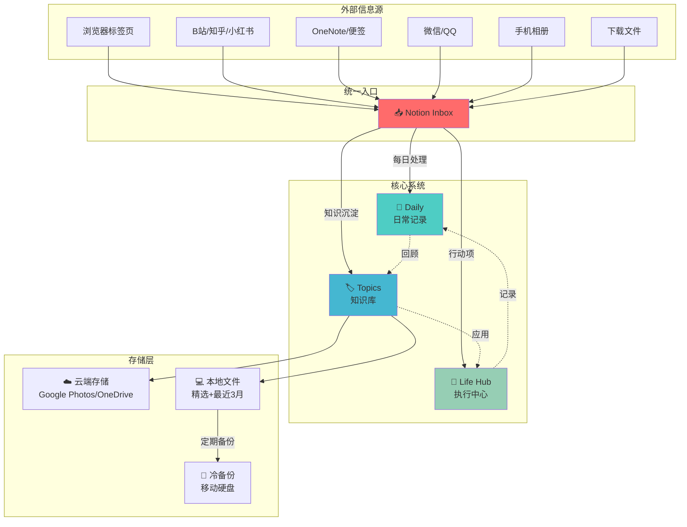

---

## 2. 信息流转流程

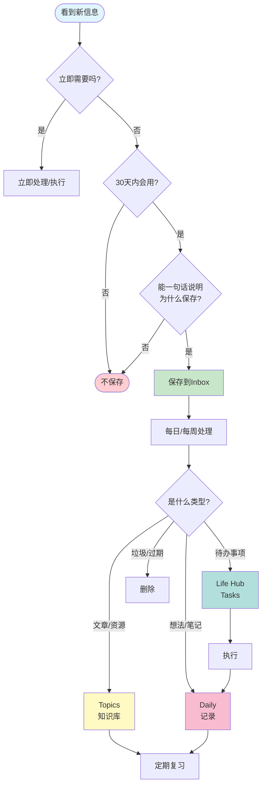

---

## 3. 浏览器标签页清理决策树

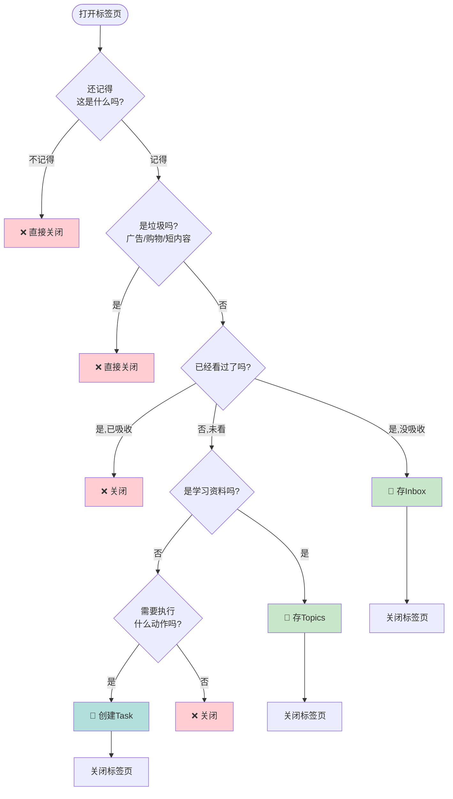

---

## 4. 每日工作流时间线

```mermaid
gantt
    title 每日信息管理工作流
    dateFormat HH:mm
    axisFormat %H:%M

    section 早晨 (09:00)
    打开Notion       :done, 09:00, 2m
    查看今日Tasks    :done, 09:02, 5m
    挑选3-5个优先任务 :done, 09:07, 3m

    section 白天工作
    执行任务         :active, 09:10, 8h
    随时记录想法到Inbox :crit, 09:10, 8h

    section 晚间 (22:00)
    清理浏览器标签页  :done, 22:00, 5m
    处理Inbox (5-10条) :done, 22:05, 10m
    填写Daily Page   :done, 22:15, 5m
    设置明日待办      :done, 22:20, 2m
```

---

## 5. 周常工作流

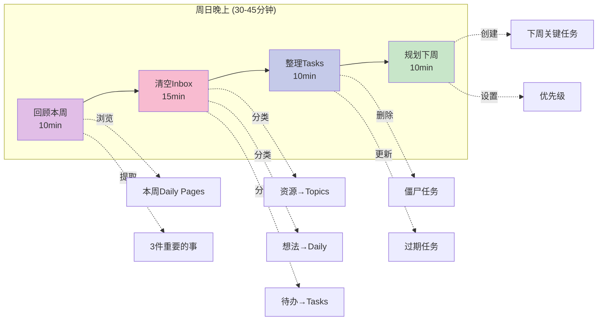

---

## 6. 文件整理流程

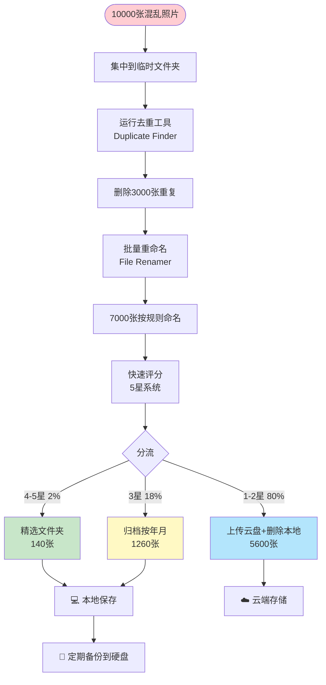

---

## 7. 收藏筛选漏斗

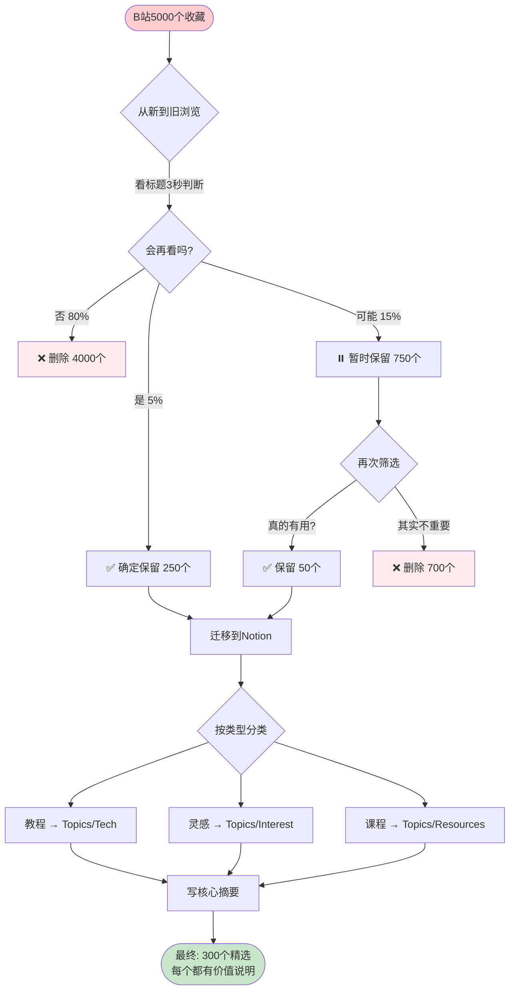

---

## 8. 决策疲劳预防机制

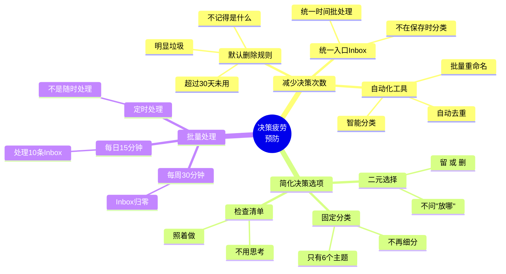

---

## 9. 系统健康度指标

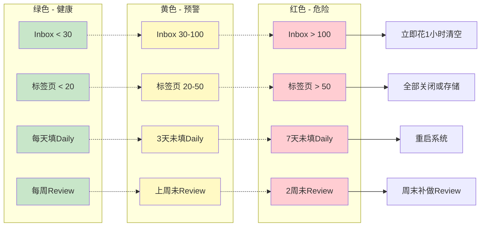

---

## 10. 30天转型路线图

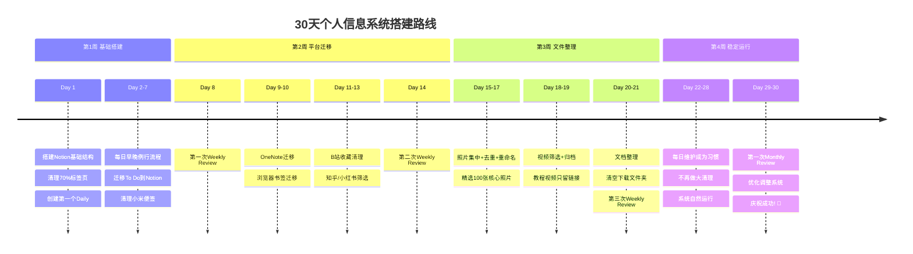

---

## 11. Notion数据库关系图

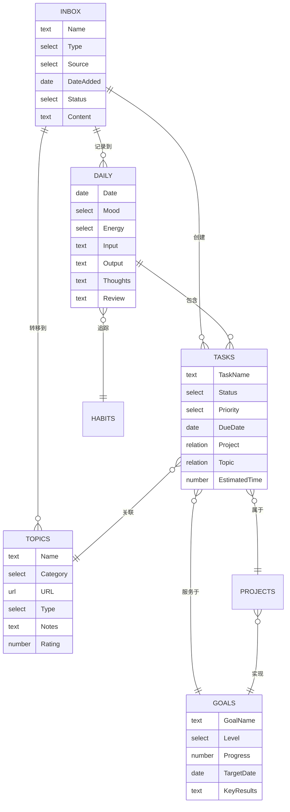

---

## 使用说明

这些流程图可以：

1. **在Markdown中直接渲染**
   - GitHub、Notion、Obsidian等都支持Mermaid语法
   - 复制粘贴到你的笔记中即可显示

2. **导出为图片**
   - 使用 [Mermaid Live Editor](https://mermaid.live/)
   - 粘贴代码 → 导出PNG/SVG

3. **打印为参考**
   - 打印"决策树"贴在电脑旁
   - 每次犹豫时看一眼

4. **自定义修改**
   - 根据你的实际情况调整流程
   - Mermaid语法简单易学

---

## 快速查看关键流程

**信息流转核心规则：**
```
新信息 → 判断是否30天内用 →
  是 → 能一句话说明为什么吗 →
    是 → 存Inbox → 定期处理 → 分流到Daily/Topics/Tasks
    否 → 不保存
  否 → 不保存
```

**每日工作流核心：**
```
早(5min)：查看今日Tasks → 挑3-5个
晚(20min)：清理标签页 → 处理Inbox → 填Daily → 设明日待办
```

**每周工作流核心：**
```
周日(30min)：回顾本周 → 清空Inbox → 整理Tasks → 规划下周
```
